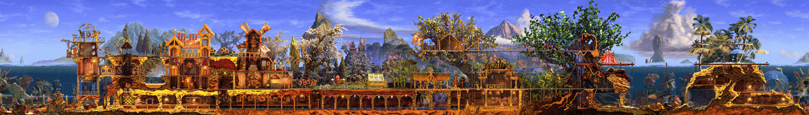

# Python reference parsers

Stdlib-only (except `render_world_background.py`, which needs
[Pillow](https://pypi.org/project/Pillow/)) reference implementations for
every Creatures 1 format this project has closed -- including
`World.sfc`, which cannot be represented as a pure declarative Kaitai
Struct `.ksy` at all (see the top-level `README.md`'s "Known gaps"
section for why: its object arrays need a runtime class-index registry
that Kaitai's `switch-on` has no mechanism to express). These are the
actual source these `.ksy` files were transcribed from, not a separate,
independently-written implementation -- if a `.ksy` and its matching
`parse_*.py` here ever disagree on some fine detail, treat this Python
side as more likely correct (it was verified first, field-by-field,
directly against the real compiled game code, and only then translated
into Kaitai's syntax).

Each module is self-contained, runnable directly (`python3 parse_cob.py
<path>`), and prints a structural confirmation log ending in either
`FORMAT: CONFIRMED` or a `STOPPED`/mismatch diagnostic naming the exact
byte offset that didn't match -- built to mechanically verify real RE
findings against real files, not just to extract data quietly.

| Module | Format | Notes |
| --- | --- | --- |
| `parse_sfc.py` | `World.sfc` (`parse_sfc`) and `.exp` (`parse_exp`) | The big one -- the full MFC-archive object graph (`MapData`, every world-object class, `Creature`/`Skeleton`/`CBrain`/`CBiochemistry`, ...). `c1exp.ksy` is a faithful port of `parse_exp`'s object tree; `parse_sfc` itself has no Kaitai equivalent (see above). |
| `parse_gene.py` | `.gen` genome files, and the payload embedded in a `.exp`'s `CGenome` | Matches `c1gen.ksy`. |
| `parse_gno.py` | `.GNO` gene-notes catalog | Matches `c1gno.ksy`. |
| `parse_cob.py` | `.cob`/`.rcb` agent packages | Matches `c1cob.ksy`. |
| `parse_spr.py` | `.spr` sprites, BOTH the standard format `c1spr.ksy` covers AND the "phased" sub-format that has no Kaitai equivalent (brute-force-verifies a phased file's real collection count, which no real loader stores on disk -- see the module's own docstring) | |
| `parse_palette.py` | `palette.dta` | Matches `c1palette.ksy`. |
| `parse_vce.py` | Standalone `.vce` voice files | Matches `c1vce.ksy`. |
| `parse_health_shop_items.py` | The Health Kit / Breeder's Kit shop item catalog (`Health`, `Aphro`) | Matches `c1shopitems.ksy`. |
| `parse_att.py` | `.att` body-part attachment-point files | Plain whitespace-delimited ASCII text, not a binary format -- no Kaitai equivalent exists or is planned. |
| `parse_wav.py` | The real C1 sound-bank `.wav` files | Not a generic RIFF/WAVE reader -- mechanically replicates `SoundManager::LoadCachedSound`'s own exact chunk-read sequence, so a mismatch here means a file doesn't fit what the real compiled engine itself expects, which is a stronger and more specific claim than "isn't a valid WAV file." |
| `render_world_background.py` | -- | Not a format parser -- renders a `World.sfc`'s background composite (`parse_sfc` + `parse_spr` + `parse_palette` together) to a real PNG, plus a second copy with every `MapData` room rectangle drawn on top, colour-coded by room type. Needs Pillow. Sample output (downscaled 6x for this repo): `sample-output/world_background_rooms_preview.png`. |

`render_world_background.py`'s output, downscaled for this README (the
real output is full resolution, 8352x1200 for this repo's own
`worldpopulated` specimen):

## Provenance

Every format here (except `.GNO`, confirmed to be a CyberLife-internal
authoring artifact never read by any retail binary -- see that module's
own docstring) was verified against the real compiled game code via a
Ghidra decompilation of `Creatures.exe` and the official C1 kit
executables, cited throughout by real function name and address (e.g.
`CBrain::Serialize (0x00402c50)`) rather than asserted from community
documentation alone. Several modules' docstrings also record real
mistakes found and fixed along the way -- wrong assumptions, decompiler
artifacts that needed raw disassembly to see through, a length byte that
coincidentally decoded as a plausible ASCII character -- left in
deliberately as a record of how each format was actually confirmed, not
just its final answer.
